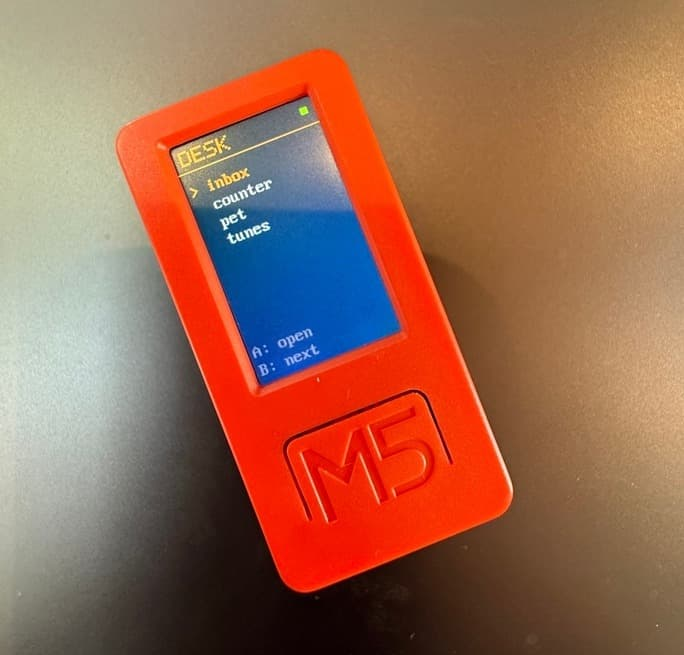
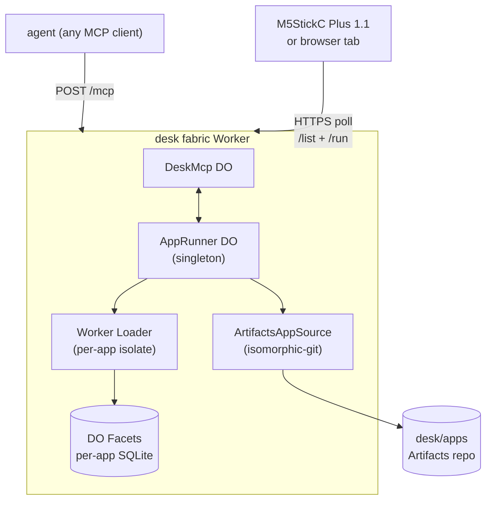

# desk

> Your wrist as an MCP surface. Your edge as the agent's I/O.

<p align="center">
  
</p>

A personal, Cloudflare-hosted platform that lets any AI agent
— Claude Desktop, Cursor, opencode, your own scripts — use
your wrist for human-in-the-loop interaction.

You own the edge. The edge owns nothing about you.

```typescript
// Any MCP-capable agent:
const decision = await desk.ask({
  question: "ship to prod?",
  options: ["ship", "cancel"],
});
// → operator's wrist takes over screen, plays a chime, shows the question
// → operator presses A or B
// → decision === { choice: "ship" } returns to the agent
```

The agent never sees the wrist. The operator never sees a
sidebar. The wrist is the I/O channel.

## Status

**v0** — one operator, one device. MIT-licensed. Working
end-to-end. Multi-device, OAuth, public app distribution, and
the prompt→app loop are not yet shipped.

## Get started

Read the [docs](./docs/index.md). Specifically:

- **First time?** [Build your first desk](./docs/tutorials/01-build-your-first-desk.md) (60–90 min)
- **Already have a CF account?** [Deploy the fabric](./docs/how-to/deploy-the-fabric.md)
- **Curious about the architecture?** [Architecture explanation](./docs/explanation/architecture.md)

## Architecture



## License

MIT. See [LICENSE](./LICENSE).
