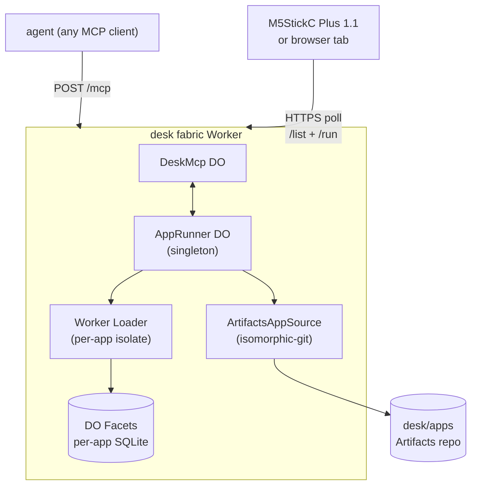

# desk

> A personal app store for tiny edge devices. `git push` installs.

<p align="center">
  
</p>

Apps live as Markdown files in a Cloudflare Artifacts git repo
you own. They run in Worker Loader isolates with state in DO
Facets. A small device — an M5StickC, a browser tab, anything
that can poll HTTPS and paint pixels — renders them.

```bash
git commit -m "+ counter app"
git push
```

That's the install. Within seconds, the new app shows up in
the device's dock. `git revert` is rollback. `git log` is the
audit trail.

Apps can do anything a small isolate can do — read button
input, render frames, persist per-app SQLite state, play
sound, expose [MCP](https://modelcontextprotocol.io) tools so
agents can drive them. The reference apps shipped with the
fabric include a counter, a virtual pet, a chiptune jukebox,
and an inbox surface that lets any MCP-capable agent ask the
operator questions out-of-band.

You own the edge. The edge owns nothing about you.

## Get started

Read the [docs](./docs/index.md). Specifically:

- **First time?** [Build your first desk](./docs/tutorials/01-build-your-first-desk.md) (60–90 min)
- **Already have a CF account?** [Deploy the fabric](./docs/how-to/deploy-the-fabric.md)
- **Curious about the architecture?** [Architecture explanation](./docs/explanation/architecture.md)

## Architecture



## License

MIT. See [LICENSE](./LICENSE).
