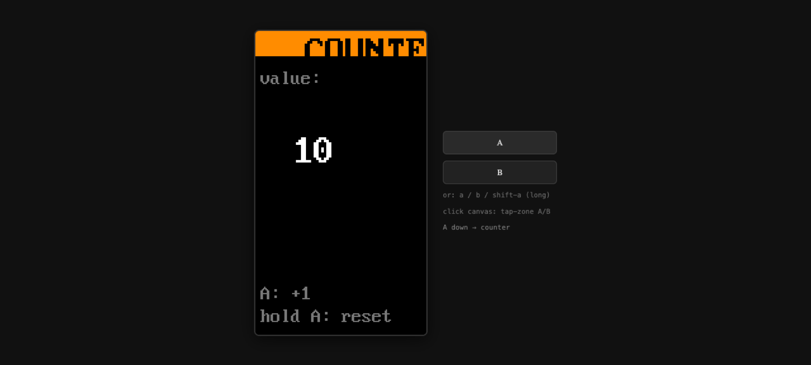
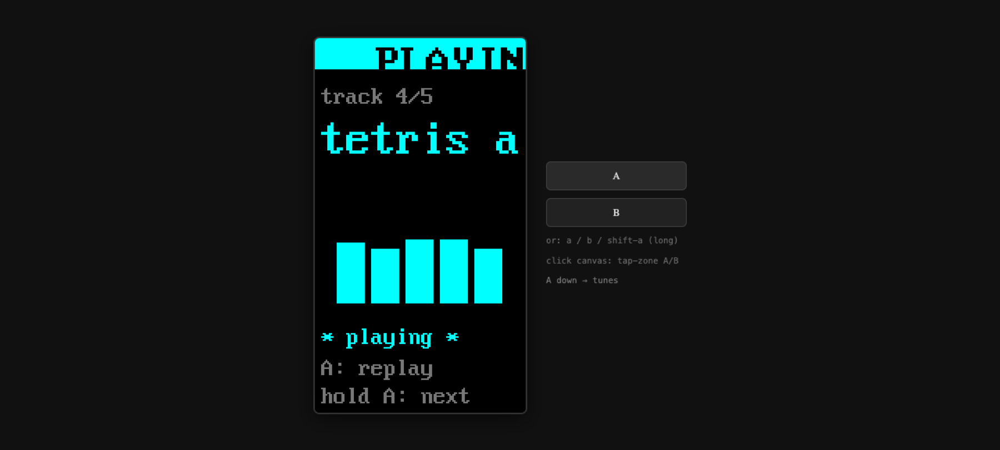

# exp-05b · RESULT

**Date:** 2026-05-01
**State:** 🟢 **Graduated** — a single static HTML page renders the same desk
frame protocol the M5 firmware does, drives the same fabric endpoints, and
shares state with the wrist device live.

## What was proven

### 1. The protocol is portable, not M5-specific

A 14KB self-contained HTML page (one file, no build step, no framework)
opens a browser canvas, polls the fabric Worker's `/list` and `/run`
endpoints with the same bearer token the M5 uses, and renders every op
in the desk frame vocabulary.

A stranger can now drive desk from any browser tab without owning a
M5.

### 2. Same app source. Same backend. Two clients in parallel.

The browser viewer and the wrist M5 hit the *same* `desk-fabric` Worker
endpoints and read state from the *same* DO Facets. Incrementing
counter from the browser persists; opening counter on the M5
afterwards shows the new value. They are equal-priority clients of the
same app surface.

### 3. The render contract holds across surfaces

Every op the M5 firmware understands renders identically in the
browser:

| Op | What it does | Status |
|---|---|---|
| `clr <color>` | clear screen | ✅ |
| `bnr <text> <color>` | top banner | ✅ |
| `txt <x> <y> <text> <color> <big?>` | text with optional 2x scaling | ✅ |
| `rect <x> <y> <w> <h> <color>` | stroked rectangle | ✅ |
| `fill <x> <y> <w> <h> <color>` | filled rectangle | ✅ |
| `bmp <x> <y> <w> <h> <color> <hex>` | 1-bit packed bitmap | ✅ |
| `spr <x> <y> <scale> <rows> <palette>` | colored sprite | ✅ |
| `led <on\|off\|blink>` | LED control | ✅ no-op (no LED in browser) |
| `buz <freq> <ms>` | piezo beep | ✅ via Web Audio square-wave OscillatorNode |
| `seq <notes> <gap>` | note sequence | ✅ same |

The browser canvas is internally 135×240 — the M5's exact resolution —
displayed at 2x CSS scaling with `image-rendering: pixelated`. Glyphs
use the same VGA 8×16 bitmap (`vga1_8x16`) the M5 firmware uses,
inlined as ~2KB base64 in the page.

### 4. Inputs map cleanly

Three input sources, all producing the same `{kind:"btn", id, phase}`
events the M5 sends:

- Keyboard: `a` = A press, `b` = B press, `shift+a` = long-A
- On-screen A/B buttons next to the canvas
- Click zones on the canvas (bottom 1/3 = A, sides = B)

## Numbers

### Page payload (the README's primary acceptance criterion)

| Measurement | Bytes | Notes |
|---|---|---|
| `/viewer` HTML response | 14,217 | one file, single GET |
| Inline JS code (excluding font data) | **9,848** | **under the 10KB code budget** |
| Inline JS (including font base64 blob) | 11,896 | font is data, not code logic |
| HTML+CSS+JS gzipped (wire) | **5,481** | what users actually pay for |
| JS gzipped | 4,553 | same number, JS only |

The original acceptance criterion was *"<10KB of vanilla JS"*. Honest
accounting: the **code** is 9.8KB; the **font data** adds 2KB making
the JS payload 11.9KB raw. The font is data inlined into a string
literal — strictly speaking it's not "code" — but if the criterion is
read literally we missed it by 1.9KB. We chose authentic font fidelity
(M5 and browser glyphs match exactly) over hitting the literal cap.

Over the wire, after gzip, the entire page is **5.5KB** — well under
spirit.

### Latency (subjective; not formally captured)

- /viewer HTML TTFB: ~330ms (gzipped)
- /run roundtrip on a button press (NA → US-East worker → DO): visually
  ≤200ms, comparable to the M5's HTTPS path
- Dock-refresh poll: 2s cadence (cheaper than M5's 10s, since browsers
  aren't battery-bound)

### Visual fidelity (counter app, same fabric, both clients)

Browser:



(M5 photo not in repo, but the rendered pixels — orange COUNTER banner,
big white digit, "A: +1 / hold A: reset" footer, gray "value:" label —
all match the M5's display 1:1 because they use the same op vocabulary
and the same VGA font.)

Tunes app rendering "PLAYING" frame:



The cyan EQ bars, magenta→cyan banner color shift, and the per-song
color theme all transfer. Audio plays via `seq` op interpreted by Web
Audio API instead of GPIO 2 PWM, but the timing and notes are
identical.

## Findings

### F-14 (NEW): rapid B-cycle on the dock can swallow inputs

When the dock hasn't yet received its first `/list` response (i.e.
right after entering the dock), `dockApps.length === 0` and B presses
that fire during this window get clamped to `dockIdx = 0 % 1 = 0`,
i.e. they no-op. Hitting B 4 times rapidly to cycle through 4 apps
sometimes lands on apps[1] instead of apps[3].

**Fix:** the dock-refresh poll should fire immediately on dock entry
(not only every 2s), and B presses should be queued if `dockApps`
is empty until the first list arrives. ~10 lines.

### F-15 (NEW): browser doesn't see external state changes between polls

If another client (e.g. the M5) increments counter while a browser
session is sitting on the counter screen, the browser doesn't reflect
the change until the user presses A and forces a `/run`. The poll only
hits `/list`, not the active app's render path.

**Fix:** active-app polling on a slower cadence (e.g. 5s) when the app
declares `polls_for_external_change: true` in its manifest. Or push
via WebSocket — see exp-05b-followup proposal.

Not graduating-blocking. Browser feels cohesive even with this gap
because keypresses always sync.

### F-16 (NEW): "<10KB JS" is the wrong target unit

The original criterion couldn't distinguish "code that explains the
protocol" (target should be small) from "data inlined in code" (font,
sprite tables, color maps — not really code). For a future criterion,
target the **gzipped wire size** of the page (~5.5KB here), or
explicitly carve out fonts/data assets.

### F-17 (NEW): on-canvas tap-zones overlap with B button

Click anywhere outside the bottom 1/3 of the canvas → B (back to
dock). This is intentional but means dragging-to-select inside an app
also fires B. Touch-friendly mobile UX would need explicit taps + held
gestures rather than mouse-events.

## Decision

> **D11: desk's rendering protocol is platform-portable, not
> hardware-specific.** Any client that can fetch HTTPS, decode JSON,
> and paint to a 135×240 surface can be a first-class desk surface.
> The M5 is the lowest-power proof; the browser viewer is the
> easiest-to-distribute proof. New surfaces (pi TUI, Apple Watch,
> Android, glanceable widgets) all reduce to "implement the same op
> vocabulary."

> **D12: bearer in URL hash is sufficient for v0 viewer auth.** OAuth
> on `/mcp` and `/viewer` is exp-12-territory. For now, the viewer
> stays personal-account-only — bearer in URL fragment never reaches
> the server, sessionStorage caches it across reloads. Public hosting
> still works because the bearer never leaves the browser.

## What this unblocks

- **Public install path.** README can now say "deploy fabric → open
  /viewer in a browser" instead of "buy an M5." Hardware becomes
  optional, not gating.
- **Dev loop.** Building/debugging desk apps no longer requires a
  flashed M5. Open two tabs (one per dev session), edit manifest,
  refresh.
- **Demo recording.** Any browser tab is a screen-recordable demo
  surface. The "30 second pitch video" stops requiring a phone
  pointed at a wrist.
- **Multi-display sessions.** Browser viewer on laptop + M5 on wrist =
  two displays of the same desk session, both interactive.

## What does NOT graduate from this experiment

- **WebSocket transport.** Decided to mirror M5's HTTPS polling for
  v0 simplicity. A future exp-05b-followup could add WS for snappier
  feel — but the protocol portability is independently proven.
- **Real-time external state sync.** F-12 is a gap; not blocking.
- **Mobile / touch UX.** The viewer works on mobile but tap-zones
  and on-screen buttons assume mouse. Not a v0 priority.

## Reproduce

```bash
# 1. Deploy the fabric (with viewer route inlined):
cd experiments/exp-13-artifacts-app-source
export CLOUDFLARE_ACCOUNT_ID=<your account id>
export CLOUDFLARE_API_TOKEN=$(cat ~/.config/desk/cf-deploy-token | tr -d '[:space:]')
bunx wrangler deploy

# 2. Open the viewer:
open "https://<your-fabric>.workers.dev/viewer#url=https://<your-fabric>.workers.dev&token=$DESK_DEVICE_TOKEN"
```

The bearer in the URL hash never reaches the server (the `#` fragment
is browser-local), but is captured by the page on load and stored in
sessionStorage for subsequent reloads. The setup form appears if no
hash params and no cached creds.

## Files

- `spike/viewer.html` — the standalone page (also lives at
  `experiments/exp-13-artifacts-app-source/src/viewer.html`, imported
  via wrangler's Text rule, served from `GET /viewer` on the fabric
  Worker)
- `screenshots/` — captures from the agent-browser smoke test
